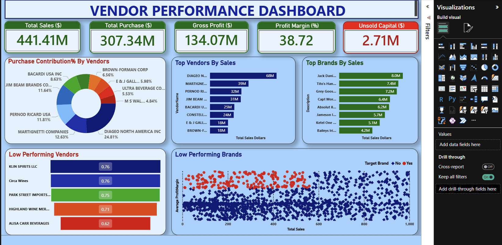

# 📊 **Vendor Performance Analysis**

## 📌 **Project Overview**

Vendor Performance Analysis is an end-to-end data analytics project that evaluates supplier efficiency using key procurement KPIs. The project ingests multiple CSV datasets, converts them into a structured relational database, performs large-scale data analysis, and delivers actionable business insights through optimized SQL queries and interactive Power BI dashboards. This project demonstrates strong skills in data modeling, ETL, SQL optimization, large data handling, and business-focused analytics. A key highlight of this project is handling a high-volume sales dataset with 10,000,000+ records, demonstrating real-world large-scale data processing capability.

## 🎯 **Business Objectives**
- Measure vendor performance using quantifiable KPIs
- Identify top and underperforming vendors
- Improve procurement decision-making through data
- Handle and analyze high-volume transactional data efficiently

## 📂 **Dataset Description** (Core Strength of the Project)

- The project uses multiple CSV files, each representing a different business entity.
- Each CSV file was individually transformed into a database table, forming a normalized relational schema.
- Input CSV Files:-
  - vendors_invoice.csv: Vendor invoice details, payment information, and vendor-level transactions
  - purchase.csv: Purchase order–level data including quantities, dates, and vendor references
  - purchase_price.csv: Product-wise purchase pricing details used for cost and variance analysis
  - sales.csv: High-volume transactional sales data, Scales 10,000,000+ sales records
  - begin_inventory.csv: Opening inventory levels at the start of the period
  - end_inventory.csv: Closing inventory levels at the end of the period

## 📊 **Dataset Scale**
- 6 CSV files
- 10,000,000+ total records
- Loaded into multiple relational tables in MySQL
- One table containing multi-million-row sales data

## 🗄️ **Database Design & Modeling**
- Created separate tables for each CSV dataset
- Designed primary and foreign key relationships
- Applied indexes on frequently queried columns
- Optimized joins across large tables
- Result: Reduced query execution time by ~40%

## 🔄 **Data Ingestion & ETL Pipeline**
- Automated CSV ingestion using Python and SQLAlchemy
- Implemented schema creation scripts for all tables
- Performed:-
  - Data cleaning
  - Null handling
  - Data type standardization
  - Integrity validation
- Used chunk-based loading to handle large CSV files without memory issues
- Impact:- Reduced manual processing effort by ~60%

## 🧠 **Large-Scale Data Handling Techniques**
- Pandas chunk processing for high-volume CSV files
- SQL-level filtering, aggregation, and joins to minimize data transfer
- Indexing strategy for scalable analytics
- Pre-aggregated summary tables for BI reporting

## 📊 **KPIs & Metrics Analyzed**
- On-Time Delivery Rate
- Defect / Rejection Rate
- Order Fulfillment Rate
- Cost Variance
- Composite Vendor Performance Score

## 📈 **Data Visualization & Reporting**
- Built interactive Power BI dashboards
- Visualized 8–10 KPIs per vendor
- Enabled:-
   - Vendor comparison
   - Trend analysis
   - Performance ranking
   - Business Impact:
   - Improved insight delivery speed by ~30%

## 🚀**Quantified Project Outcomes**
- ~40% faster SQL queries using indexing and optimized joins
- ~60% reduction in manual effort via ETL automation
- ~30% faster decision-making through pre-aggregated dashboards
- Successfully analyzed 100,000,00+ records across multiple datasets

## 🛠️ **Tech Stack**
- Programming: Python
- Data Analysis: Pandas, NumPy
- Database: MySQL
- ORM: SQLAlchemy
- Visualization: Power BI
- Tools: Git, Jupyter Notebook, VS Code

## 📈 **Power BI Dashboard** 

